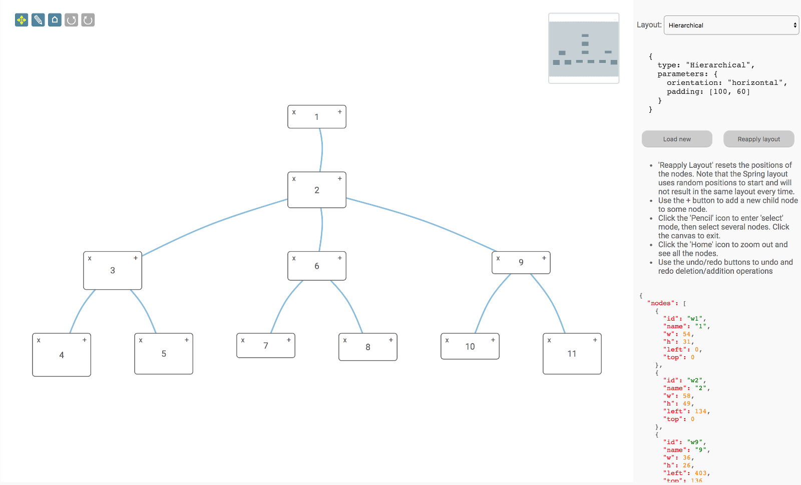
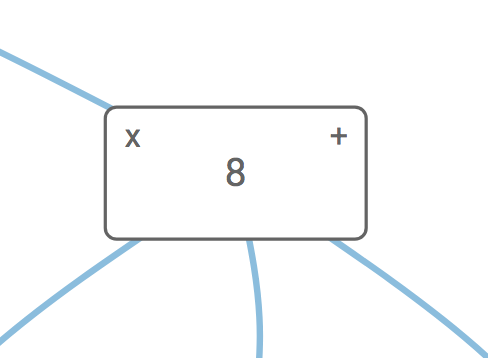

<a id="top"></a>
## Layouts Demonstration

- [package.json](#package)
- [Page Setup](#setup)
- [Templates](#templates)
- [Data Loading](#loading)
- [View](#view)
- [Undo/Redo](#undo-redo)
- [Rendering](#rendering)
- [Switching Layouts](#layoutSelect)
- [Selecting Nodes](#selecting)
- [Adding New Nodes](#adding)
- [Deleting Nodes](#deleting)


This is an example of the various layouts available with the Toolkit. 



<a id="package"></a>
### package.json

```javascript
{
    "dependencies": {
        "font-awesome": "^4.7.0",
        "jsplumbtoolkit": "file:../../jsplumbtoolkit.tgz"
    }
}

```

[TOP](#top)

---

<a id="setup"></a>
### Page Setup

#### CSS

```xml
<link href="node_modules/font-awesome/css/font-awesome.min.css" rel="stylesheet">
<link rel="stylesheet" href="node_modules/jsplumbtoolkit/dist/css/jsplumbtoolkit-defaults.css">
<link rel="stylesheet" href="node_modules/jsplumbtoolkit/dist/css/jsplumbtoolkit-demo.css">
<link rel="stylesheet" href="app.css">
```
Font Awesome, `jsplumbtoolkit-demo.css`, and `app.css` are used for this demo and are not jsPlumb Toolkit requirements. `jsplumbtoolkit-defaults.css` is recommended for 
all apps using the Toolkit, at least when you first start to build your app. This stylesheet contains sane defaults for the various widgets in the Toolkit. 

#### JS

```xml
<script src="node_modules/jsplumbtoolkit/dist/js/jsplumbtoolkit.js"></script>
<script src="demo-support.js"></script>
<script src="app.js"></script>
```

We import `jsplumbtoolkit.js` from `node_modules` (it was listed in `package.json`). `demo-support.js` is used to generate random data sets for the demo. `app.js` contains the demo code; it is
discussed on this page.

[TOP](#top)

---

<a id="templates"></a>
### Templates

This demonstration uses a single template to render its nodes:

```xml
<script type="jtk" id="tmplNode">
    <div style="width:${w}px;height:${h}px;">
        <div class="name">
            <div class="delete" title="Click to delete">
                <i class="fa fa-times"/>
            </div>
            <span>${name}</span>
            <div class="add" title="Add child node">
                <i class="fa fa-plus"/>
            </div>
        </div>
    </div>
</script>
```

[TOP](#top)

---

<a id="init"></a>
### Initialization

We get an instance of the Toolkit and provide a [beforeStartDetach](https://docs.jsplumbtoolkit.com/toolkit/current/articles/data-modell#constraining-connectivity) interceptor. Our function does not return `true` and so the user is not able to detach any edges:

```javascript
var toolkit = window.toolkit = jsPlumbToolkit.newInstance({
  beforeStartDetach:function() { return false; }
});
```

Note: we expose `toolkit` on the window because it's useful when explaining things to people to be able to reference some code that is available on the internet. You do not need to do this, of course.

[TOP](#top)

---

<a id="loading"></a>
### Data Loading

Data for the demonstration is created using the `randomHierarchy` function from the included `demo-support.js` file.  This function creates an arbitrary hierarchy and assigns different widths/heights to the various nodes.

The data is prepared with this call :

```javascript
var hierarchy = jsPlumbToolkitDemoSupport.randomHierarchy(3);
```

And then loaded with this call:

```javascript
toolkit.load({type: "json", data: hierarchy});
```

The `load` function takes an optional `type` parameter that indicates the format of the data you are loading. If not supplied - as is the case here - it defaults to `"json"`, which refers to the Toolkit's [default Graph JSON syntax](https://docs.jsplumbtoolkit.com/toolkit/current/articles/loading-and-saving-data#graph-json-syntax).


[TOP](#top)

---

<a id="view"></a>
### View

The view for this demonstration maps a single node template:

```javascript
var view = {
    nodes: {
        "default": {
            template: "tmplNode"
        }
    },
    edges: {
        "default": {
            connector: [ "StateMachine", { curviness: 10 } ],
            paintStyle: { strokeWidth: 2, stroke: '#89bcde' },
            endpoints: [ [ "Dot", { radius: 4 } ], "Blank" ]
        }
    }
}
```

[TOP](#top)

---

<a name="undo-redo"></a>
### Undo/Redo

In this demonstration it is possible to undo/redo the addition or removal of tables, views, columns and relationships. This is achieved through the use of a `jsPlumbToolkitUndoRedo` manager.

We set it up after creating our instance of the Toolkit:

```javascript
var undoredo = new jsPlumbToolkitUndoRedo({
    toolkit:toolkit,
    onChange:function(undo, undoSize, redoSize) {
        controls.setAttribute("can-undo", undoSize > 0);
        controls.setAttribute("can-redo", redoSize > 0);
    },
    compound:true
});

jsPlumb.on(controls, "tap", "[undo]", function () {
    undoredo.undo();
});

jsPlumb.on(controls, "tap", "[redo]", function () {
    undoredo.redo();
});
```

The `controls` element referred to here looks like this in the HTML:

```html
<div class="controls">
    <i class="fa fa-arrows selected-mode" mode="pan" title="Pan Mode"></i>
    <i class="fa fa-pencil" mode="select" title="Select Mode"></i>
    <i class="fa fa-home" reset title="Zoom To Fit"></i>
    <i class="fa fa-undo" undo title="Undo last action"></i>
    <i class="fa fa-repeat" redo title="Redo last action"></i>
</div>
```

The last two items in this list are our `undo` and `redo` buttons - we declared an appropriate attribute with which to identify each button, and then we bind to tap events on those buttons, for instance:
 
```javascript
jsPlumb.on(controls, "tap", "[undo]", function () {
    undoredo.undo();
});
```

The `undo` and `redo` commands have no effect on the undo/redo manager if there is nothing to undo or redo when they are called.

#### Responding to undo/redo events

We declared an `onChange` handler in the undo/redo manager constructor. Our handler simply sets a `can-undo` and `can-redo` attribute on the controls element, depending on the size of the undo and redo stacks when the callback is invoked. We use CSS (see below) to use these attributes to manage the UI.

```javascript
onChange:function(undo, undoSize, redoSize) {
    controls.setAttribute("can-undo", undoSize > 0);
    controls.setAttribute("can-redo", redoSize > 0);
}
```

#### Compound events

Notice the `compound:true` parameter on the undo/redo constructor?  It tells the undo manager that when a node/port/group is deleted that had edges connected to it, the deletion of the node/port/group and its connected edges should be treated as one, compound, event on the stack. That is, hitting undo after deleting a node with several edges should reinstate both the node and all of the edges. The default behaviour of the undo manager is to treat the node deletion and each of its connected edge deletions as separate events on the undo stack.

#### CSS

This is the CSS we use:

```css
[undo], [redo] { background-color:darkgray !important; }
[can-undo='true'] [undo], [can-redo='true'] [redo] { background-color: #3E7E9C  !important; }
```

[TOP](#top)

---

<a id="rendering"></a>
### Rendering

This is the call that sets up the UI:

```javascript
toolkit.render({
  container: canvasElement,
  zoomToFit: true,
  view: view,
  layout: {
      type: "Hierarchical",
          parameters: {
              orientation: "horizontal",
              padding: [100, 60]
          }
  },
  miniview: {
      container:miniviewElement
  },
  lassoFilter: ".controls, .controls *, .miniview, .miniview *",
  events: {
      canvasClick: function (e) {
          toolkit.clearSelection();
      },
      modeChanged: function (mode) {
          jsPlumb.removeClass(jsPlumb.getSelector("[mode]"), "selected-mode");
          jsPlumb.addClass(jsPlumb.getSelector("[mode='" + mode + "']"), "selected-mode");
      }
  },
  jsPlumb: {
      Anchor: "Center",
      EndpointStyle: { fill: "gray" },
      EndpointHoverStyle: { fill: "#FF6600" },
      HoverPaintStyle: {strokeWidth: 4, stroke: "orange"}
  },
  refreshLayoutOnEdgeConnect:true
});
```

Here's an explanation of what the various parameters mean:

- **container**

This identifies the element into which you wish the Toolkit to render.

- **zoomToFit**

Setting this to true causes the Toolkit to zoom to show all available nodes after loading the data.

- **layout**

Parameters for the layout. 

```javascript
{
  type: "Hierarchical",
  parameters: {
      orientation: "horizontal",
      padding: [100, 60]
  }
}
```

We specify a `Hierarchical` layout for when the page loads. See [below](#layoutSelect) for a discussion of how we switch the layout. 

- **miniview**

```javascript
{
  container:miniviewElement,
  initiallyVisible:false
}
```

The miniview options specify the element to convert into a miniview, and `initiallyVisible:false` instructs the miniview to remain hidden until some data has been loaded. You can also provide an element ID as the `container` parameter.

- **lassoFilter**

This selector specifies elements on which a mousedown should not cause the selection lasso to begin. In this demonstration we exclude the buttons in the top left and the miniview.

- **events**

We listen for two events:

  `canvasClick` - a click somewhere on the widget's whitespace. Then we clear the Toolkit's current selection.
  
  `modeChanged` - Surface's mode has changed (either "select" or "pan"). We update the state of the buttons.


- **jsPlumb**

Recall that the Surface widget is backed by an instance of jsPlumb. This parameter sets the [Defaults](https://docs.jsplumbtoolkit.com/toolkit/current/articles/defaults.html) for that object.
  
- **refreshLayoutOnEdgeConnect**

By default, the layout will not be recomputed when new Edges are established. This tells the Toolkit to redraw whenever a new Edge is
added (which happens in this demonstration after the user presses a + button on a Node).

[TOP](#top)

---

<a id="layoutSelect"></a>
### Switching Layouts

Several layout types are available, for some of which we set specific parameters.

#### Hierarchical

This is the classic "organisation chart" layout, using a modified version of the
Walker algorithm.  The parameters used are:

```javascript
{
    type:"Hierarchical",
    parameters:{
        orientation:"horizontal",
        padding:[160, 60]
    }
}
```

`orientation`'s default value is in fact `horizontal`; we include it for completeness.

#### Hierarchical - vertical

This is the same layout as before, but running across the page instead of down. Parameters used are:

```javascript
{
    type:"Hierarchical",
    parameters:{
        orientation:"vertical",
        padding:[160,60]
    }
}
```

#### Hierarchical - inverted

The horizontal Hierarchical layout, with the root node at the bottom

```javascript
{
    type:"Hierarchical",
    parameters: {
        orientation: "horizontal",
        padding: [100, 60],
        invert:true
    }
}
```

#### Spring

In this layout, nodes here are positioned randomly and then moved as if they were connected to each other with springs. This layout is "absoluteBacked" by default, meaning that if your node data contains positioning information (by default, `left` and `top` properties, but this can be changed), this data will take precedence over the position assigned by the layout. In this demonstration we do have positioning data in our nodes (for the Absolute layout), so we switch off this behaviour.  Parameters are:

```javascript
{
    type:"Spring",
    absoluteBacked:false
}
```

#### Circular

```javascript
{
    type:"Circular"
}
```

#### Balloon

There are many datasets that can be efficiently represented using this layout.

```javascript
{
    type:"Balloon"
}
```

#### Absolute

This layout reads element positions from the backing data of Nodes. By default these are the `left` and `top` properties, but this
can be set in the parameters for the layout.

```javascript
{
    type:"Absolute"
}
```

#### Switching the layout

The code that switches the layout jumps through a few demonstration-related hoops to get a suitable set of parameters for each layout. The call on the Surface widget, though, looks like this:

```javascript
jsPlumb.on(layoutSelector, "change", function() {
    
    // ...get `lp` - the parameters for the layout
        
    renderer.setLayout(lp);
    renderer.zoomToFit();
});
```

After changing the layout we zoom out to make all the nodes visible.

[TOP](#top)

---

<a id="selecting"></a>
### Selecting Nodes

Lasso selection is enabled by default on the Surface widget. To activate the lasso, click the pencil icon in the toolbar:


The code that listens to clicks on this icon is as follows:

```javascript
// pan mode/select mode
jsPlumb.on(".controls", "tap", "[mode]", function () {
  renderer.setMode(this.getAttribute("mode"));
});
```

The tap listener extracts the desired mode from the button that was clicked and sets it on the renderer. This causes a `modeChanged` event to be fired, which is picked up by the `modeChanged` event listener in the View.

Note that here we could have used a `click` listener, but `tap` works better for mobile devices. 

##### Lasso Operation

The lasso works in two ways: when you drag from left to right, any node that intersects your lasso will be selected.  When you drag from right to left, only nodes that are enclosed by your lasso will be selected.

##### Exiting Select Mode

The Surface widget automatically exits select mode once the user has selected something. In this application we also listen to clicks on the whitespace in the widget and switch back to pan mode when we detect one. This is the `events` argument to the `render` call:

```javascript
events: {
  canvasClick: function (e) {
    toolkit.clearSelection();
  }
}
```

`clearSelection` clears the current selection and switches back to Pan mode.

[TOP](#top)

---

<a id="adding"></a>
### Adding New Nodes

Each node in this demonstration has two buttons:



Clicking on the **+** button causes a new node to be added as a child of the current Node. Here's the code that sets up the listener and adds the child:

```javascript
jsPlumb.on(canvasElement, "tap", ".add", function (e) {
  // this helper method can retrieve the associated
  // toolkit information from any DOM element.
  var info = toolkit.getObjectInfo(this);
  // get data for a random node.
  var n = jsPlumbToolkitDemoSupport.randomNode();

  undoredo.transaction(function() {
      // add the node to the toolkit
      var newNode = toolkit.addNode(n);
      // and add an edge for it from the current node.
      toolkit.addEdge({source: info.obj, target: newNode});      
  });              
});
```

Note how we wrap the addition of the new node and the connection of it to its parent in a transaction on the undo/redo manager - this causes both operations to be represented by a single entry on the undo stack, meaning they will be unapplied/applied together.


[TOP](#top)

---

<a name="deleting"></a>
### Deleting Nodes

Clicking the delete button in this demonstration deletes not just the current node, but also all of its descendants. This is done by creating a [Selection](https://docs.jsplumbtoolkit.com/toolkit/current/articles/selections#descendantSelection) and then instructing the Toolkit to remove everything in that Selection:

```javascript
jsPlumb.on(canvasElement, "tap", ".delete ", function (e) {
  var info = toolkit.getObjectInfo(this);
  var selection = toolkit.selectDescendants(info.obj, true);
  undoredo.transaction(function() {
    toolkit.remove(selection);    
  });  
});
```

Again, notice how we wrap the `remove` call on the Toolkit in a `transaction` on the undo/redo manager. This means that all the removals that occur as a result of the selection remove operations will be treated as a single operation in the undo stack. Undoing the given operation will reinstate everything that was deleted; redoing it will delete everything again.

[TOP](#top)
